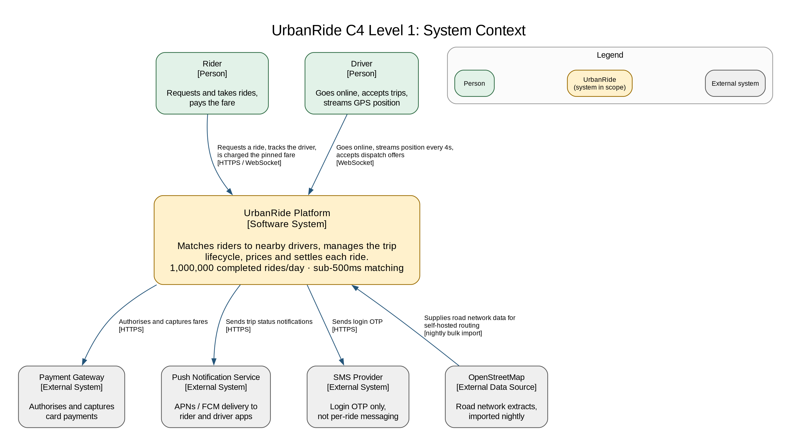
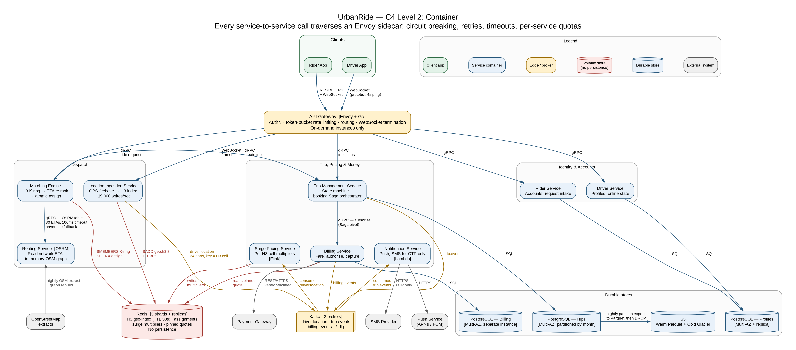

## 4. Domain & Service Decomposition

<!-- OWNER: M1 | SOURCE: Brief §5.1, §5.2 | TARGET: ~3 pages | RUBRIC: 25% -->

### 4.1 Bounded contexts

The decomposition follows domain-driven design rather than technical layering. A bounded context
is a region of the domain with its own consistent vocabulary and its own rules, and each context
becomes a service that owns its data outright. The test we applied to every candidate boundary was
whether the two halves would ever need to change, scale, or fail independently. Where the answer
was yes, they were separated even when they appeared to belong to the same subject.

That test matters here because the obvious decomposition — one service per noun — produces the
wrong answer for a ride-hailing platform. "Driver" is a single noun that covers two workloads with
nothing in common: a durable account record that changes a few times a week, and a stream of GPS
coordinates arriving roughly 19,000 times a second that is worthless within seconds of arrival.
Those belong in different contexts, and §4.3 defends that split in detail.

Ten services across eight bounded contexts:

| Bounded context | Services | Responsibility of the context |
|---|---|---|
| Edge | `API Gateway` | Authentication, rate limiting, request routing, WebSocket termination |
| Identity & Accounts | `Rider Service`, `Driver Service` | Durable participant records and account state |
| Real-time Location | `Location Ingestion Service` | The GPS firehose and the geospatial index built from it |
| Dispatch | `Matching Engine`, `Routing Service` | Turning a ride request into an assigned driver |
| Trip Lifecycle | `Trip Management Service` | The authoritative state of a ride from request to completion |
| Pricing | `Surge Pricing Service` | Demand-based multipliers per geographic area |
| Financial | `Billing Service` | Fare calculation, payment authorisation and capture |
| Communications | `Notification Service` | Push, and SMS for login OTP only |

### 4.2 Service catalogue

<!-- Copy from Brief §5.1. THESE NAMES ARE CANONICAL - everyone uses them verbatim. -->

The names in the first column are canonical and are used verbatim throughout this document, in
every diagram, and in the presentation. They are recorded in `DECISIONS.md`.

| Service | Responsibility | Why separate | Data store |
|---|---|---|---|
| `API Gateway` | Terminates client connections, authenticates requests, enforces rate limits, routes to services, terminates rider and driver WebSockets | A single enforcement point for authentication and rate limiting; no service should have to re-implement either | None — stateless |
| `Rider Service` | Rider accounts, saved places, ride request intake | Read-heavy, low write volume, and a different scaling profile from drivers | `PostgreSQL` |
| `Driver Service` | Driver profiles, vehicle records, online/offline state, document status | Slow-changing durable data that must survive a crash | `PostgreSQL` |
| `Location Ingestion Service` | Consumes the GPS ping firehose, maintains the `H3` geospatial index of online drivers | Roughly 19,000 writes/sec of data that is disposable within seconds — the opposite durability requirement from `Driver Service` | `Redis`, no persistence |
| `Matching Engine` | Selects a driver for a ride request; candidate generation, ranking, and atomic assignment | Latency-critical and CPU-bound; must scale on p99 latency independently of everything else | `Redis` (reads) |
| `Routing Service` | Road-network travel time and distance; self-hosted `OSRM` over OpenStreetMap data | Holds a large road graph in RAM and is the only CPU-bound component on the critical path; also the single largest cost decision in the design | In-memory OSM graph |
| `Trip Management Service` | The trip state machine and the booking Saga orchestrator; source of truth for every ride | Needs strong consistency and must be able to answer "what state is trip X in right now?" | `PostgreSQL` |
| `Surge Pricing Service` | Per-hexagon demand multipliers computed over a rolling window | Fully asynchronous and tolerant of staleness; failure here must never block a booking | `Redis` + Flink state |
| `Billing Service` | Fare calculation, payment authorisation and capture, refunds | Money requires strong consistency and an isolated blast radius | `PostgreSQL`, separate instance |
| `Notification Service` | Push notifications, SMS for login OTP | Low frequency and bursty; a natural fit for serverless, and its failure must not affect a trip | None |

**Ten services, not nine.** The research brief grouped routing with matching. We separate
`Routing Service` because self-hosted `OSRM` is both the largest single infrastructure line item
and the decision that brings the design inside the cost ceiling at all (§8.2). A component that
carries that much of the argument must be visible as its own container on the C4 Level 2 diagram,
not hidden inside another service's box.

### 4.3 Decomposition rationale

<!-- Call out the non-obvious splits:
     - Location Ingestion Service vs Driver Service (opposite write profiles)
     - Billing isolated (separate blast radius) -->

Most of the boundaries above are conventional. Three are not, and they are the ones worth
defending.

**`Location Ingestion Service` versus `Driver Service`.** These look like one domain and are
routinely modelled as one. They have opposite profiles in every dimension that matters. The driver
profile is a few hundred writes per second at most, must survive a total cluster loss, and is read
during onboarding, support and payouts. A driver's location is roughly 19,000 writes per second,
is worthless four seconds after it arrives, and is read only by the `Matching Engine`. Combining
them means paying durable-database prices — replication, write-ahead logging, backups, Multi-AZ
failover — for data we would happily throw away. It also couples the scaling of the two: a
location write spike would contend for connections with profile reads. Kept apart, the location
index is an unreplicated `Redis` instance with a 30-second TTL that rebuilds itself within one
ping interval if it is lost, and the driver database is a small, boring, durable `PostgreSQL`
instance. This is the split we would defend first if challenged.

**`Billing Service` on its own `PostgreSQL` instance.** Every service owns its own database, so
giving `Billing Service` a separate store is not itself remarkable. Putting it on a physically
separate instance is. The reason is blast radius rather than throughput: at roughly 12 completed
rides per second the billing write load is trivial, but a runaway query, a connection-pool
exhaustion or a bad migration in the trip path must not be able to take down payment
authorisation, and the reverse must also hold. Money is the one place in this system where being
unavailable is clearly preferable to being wrong, and physical isolation is how we keep that
choice available to us.

**`Surge Pricing Service` outside the booking path.** Surge is computed from a Kafka stream and
read from `Redis`; the `Matching Engine` never calls it synchronously and never waits for it. If
the surge pipeline stops, the last computed multiplier is served until its TTL expires and pricing
falls back to the base fare. A pricing feature that can halt bookings is a liability, so the
boundary is drawn to make that failure mode impossible rather than merely unlikely.

### 4.4 Inter-service communication

| Path | Protocol | Reasoning |
|---|---|---|
| Driver app → `API Gateway` → `Location Ingestion Service` | WebSocket, protobuf frames | A persistent connection avoids a TCP and TLS handshake per ping at roughly 19,000 messages/sec. The same socket carries dispatch offers back down to the driver |
| Rider app → `API Gateway` | REST over HTTPS, plus WebSocket for live trip updates | REST keeps request/response simple for booking and account calls; the WebSocket pushes driver position and state changes without polling |
| `Matching Engine` → `Routing Service` | gRPC | Binary protobuf over multiplexed HTTP/2, with generated type-safe stubs. This path carries the ETA ranking call inside a 500ms budget, so serialisation cost is not negligible |
| `Matching Engine` → `Trip Management Service` | gRPC | The caller cannot proceed until the trip record exists; a synchronous call with a hard timeout is the honest representation of that dependency |
| `Trip Management Service` → `Billing Service` | gRPC | Payment authorisation is the Saga's pivot transaction (§6.4) and its result determines whether the booking proceeds |
| `Trip Management Service` → `Notification Service`, analytics, driver earnings | `Kafka` — `trip.events` topic | Nothing downstream of trip state needs to block the rider's response |
| `Location Ingestion Service` → geo-indexer, `Surge Pricing Service` | `Kafka` — `driver.location` topic | Decouples the write firehose from every consumer of it, and is what makes the 5x burst absorbable (§5.7) |
| `Billing Service` → analytics, reconciliation | `Kafka` — `billing.events` topic | Financial reporting is never on a user-facing path |
| `Billing Service` → payment gateway | REST over HTTPS | Vendor-dictated; not our choice |
| All service-to-service traffic | via `Envoy` sidecar | Circuit breaking, retries, timeouts and per-service quotas are implemented once in the mesh rather than in ten codebases (§7.1) |

The governing rule is deliberately narrow: **synchronous only where the caller genuinely cannot
proceed without the answer; everything else is an event.** Applying it leaves four synchronous
hops in the booking path and moves everything else onto `Kafka`. That is what makes a 5x demand
spike a queue-depth problem rather than a cascading-timeout problem — a direct-write architecture
would convert the same spike into connection-pool exhaustion across every service at once.

### 4.5 Data ownership & isolation

<!-- Database-per-service; no shared schemas; no cross-service joins -->

Each service owns its data store exclusively. No other service connects to it, no schema is
shared, and there are no cross-service joins. A service that needs another's data either calls its
API or consumes its events; it never reaches into the other's tables. The per-service storage
choices and their consistency models are set out in §6.1, and are not restated here so the two
sections cannot drift apart.

The direct consequence is that no single ACID transaction can span a booking, because a booking
touches `Trip Management Service`, `Matching Engine` and `Billing Service`. That is not a gap in
the design; it is the cost of the isolation above, paid deliberately, and it is why the booking
flow is implemented as an orchestrated Saga with explicit compensating transactions (§6.4). The
alternative — a shared database that permits a distributed transaction — would restore atomicity
at the price of coupling every service's schema, deployment and failure domain to every other's.

Ownership is also what makes the storage decisions in §6.1 possible at all. Because
`Location Ingestion Service` owns its index outright, we can choose to run it without persistence;
because `Billing Service` owns its database outright, we can choose to run it Multi-AZ with strong
consistency. A shared store would force one consistency model onto workloads that need different
ones.

---

{width=100%}

**Figure 1 — C4 Level 1: System Context.** UrbanRide as a single system, showing the two classes
of user and the four external systems it depends on. Self-hosting routing on OpenStreetMap data,
rather than calling a commercial maps API per request, is the decision that keeps the platform
inside the 10 LKR per ride ceiling (§8.2).

<!-- DIAGRAM 1 | OWNER: M1 | FILE: diagrams/c4-01-context.png
     Shows: UrbanRide as one box; external actors = Rider, Driver, Payment Gateway,
     SMS Provider, Push Notification Service, OpenStreetMap data source.
     Keep deliberately simple - this is for non-technical stakeholders. -->

---

{width=100%}

**Figure 2 — C4 Level 2: Container.** All ten services with their data stores and the protocol on
every connection. The two paths worth tracing are the booking path — rider to `API Gateway` to
`Matching Engine`, then gRPC to `Routing Service` and `Trip Management Service` — and the location
firehose, which enters over WebSocket and is decoupled from every consumer by the
`driver.location` topic on `Kafka`.

<!-- DIAGRAM 2 | OWNER: M1 | FILE: diagrams/c4-02-container.png
     Shows: all 9 services + API Gateway + Kafka + Redis + PostgreSQL + OSRM + S3.
     LABEL EVERY ARROW with its protocol (gRPC / REST / WebSocket / Kafka topic).
     This is the most important diagram in the document. -->
