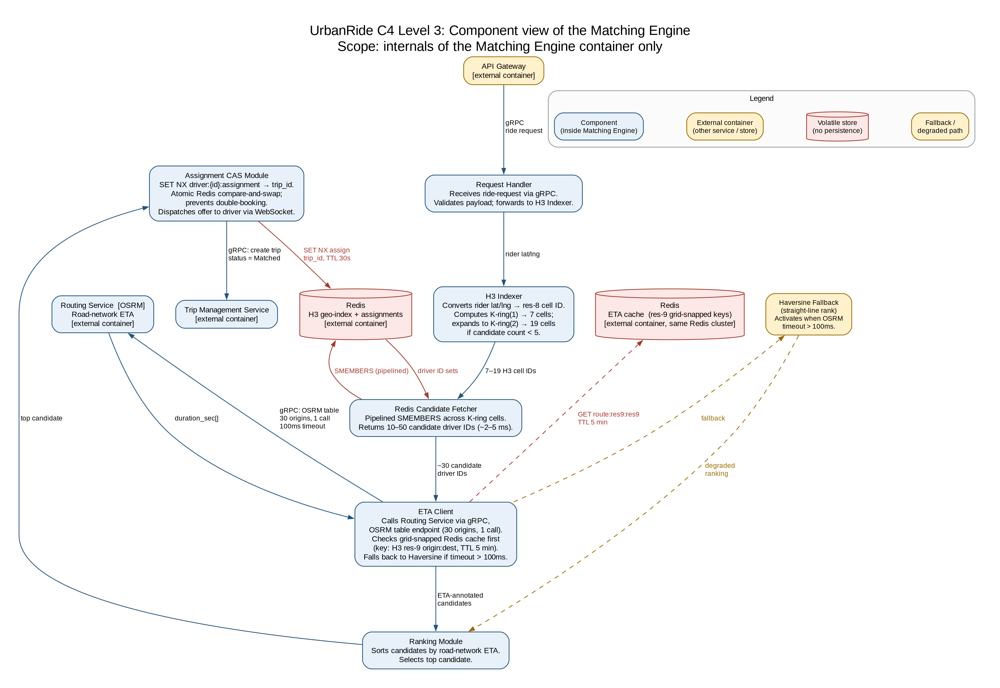
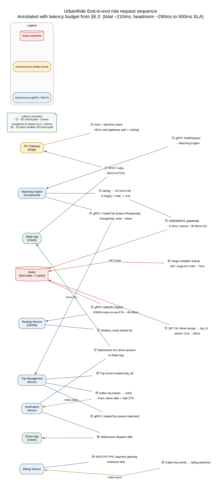

## 5. Performance & Latency Design

<!-- OWNER: M2 | SOURCE: Brief §5.3, §5.3.1, §5.4 | TARGET: ~3.5 pages | RUBRIC: 25% -->

### 5.1 Geospatial indexing strategy

The Matching Engine uses **H3**, an open-source hierarchical geospatial indexing system (Apache 2.0 licence) that partitions the Earth's surface into hexagonal cells at 16 resolutions. Each cell is addressed by a compact 64-bit identifier.

**Why hexagons over squares?** All six neighbours of a hexagon are equidistant from its centre. A square grid has four edge-neighbours and four diagonal-neighbours at different distances, so "expand the search radius" is a non-uniform operation on a square grid. Hexagons give uniform expansion, because every K-ring step adds cells at the same geometric distance, which makes candidate set size predictable.

**Resolution choice: Resolution 8.** At resolution 8, each cell covers approximately 0.74 km². This is calibrated so that a rider and the nearest drivers almost always share a cell or a first-ring neighbour, while keeping the candidate set small enough for ETA ranking to complete within the latency budget. Finer resolutions produce too many cells per query; coarser resolutions produce too many drivers per cell and defeat the purpose of filtering.

**Redis key structure:**

```
Key:   geo:h3:8928308280fffff        (H3 res-8 cell ID, 64-bit hex string)
Value: SET of driver_ids
TTL:   30 seconds                     (stale drivers self-evict; no cleanup job needed)

Also:
  driver:{id}:loc         →  {lat, lng, heading, updated_at}   TTL 30s
  driver:{id}:assignment  →  trip_id                           TTL 30s
```

Driver location is treated as **disposable in-memory data with no persistence**. If a Redis node fails, all driver locations are rebuilt within a single GPS ping cycle (4 seconds) as drivers re-register. Industry research on production ride-hailing systems confirms this pattern: the driver location index is held entirely in memory with no disk backing, because a location record older than one ping interval is already superseded. The TTL-based expiry means a driver who goes offline simply disappears from the index within 30 seconds without any explicit deregistration step.

**K-ring expansion logic.** When the initial query returns fewer than five candidates, the Matching Engine expands its search:

- **K-ring(1):** the origin cell plus its 6 immediate neighbours → **7 cells total**
- **K-ring(2):** adds the next ring outward → **19 cells total**
- Expansion stops when ≥ 5 candidates are found, or K-ring(2) is exhausted (rare; implies a genuinely sparse area)

### 5.2 Matching query flow

The following steps execute on the Matching Engine for every ride request:

1. **Rider lat/lng → H3 cell ID:** the H3 library converts coordinates to a res-8 cell ID entirely in-process. Cost: **< 1ms** (pure arithmetic, no I/O).
2. **K-ring(1) expansion:** compute the 7-cell neighbourhood ring. Cost: **< 1ms**.
3. **Redis pipelined `SMEMBERS`:** fetch all driver IDs from all 7 cells in a single pipelined command batch. Returns 10–50 candidate driver IDs typically. Cost: **~2–5ms** (single round-trip, pipeline reduces overhead).
4. **Candidate expansion if needed:** if fewer than 5 drivers returned, expand to K-ring(2) (19 cells) and repeat the Redis fetch. This path is uncommon in dense urban areas.
5. **Road-network ETA ranking:** send the ~30 candidate driver IDs and rider pickup coordinates to the Routing Service. The Routing Service calls OSRM's `table` endpoint (one request, shared graph traversal) and returns duration-sorted candidates. Cost: **~50–80ms**.
6. **Surge multiplier lookup:** retrieve the current demand multiplier for the rider's H3 cell from Redis. Cost: **~5ms** (simple key lookup).
7. **Trip record write:** write the initial trip record to PostgreSQL with status `Requested`. Cost: **~30ms**.
8. **Assignment CAS + dispatch:** atomically assign the top-ranked driver using a Redis Compare-And-Swap operation (prevents double-booking). Push the dispatch offer to the driver app via WebSocket on the Location Ingestion Service. Cost: **~20ms**.

### 5.3 Latency budget

| Step | Budget |
|---|---|
| Gateway auth + routing | 20ms |
| H3 computation (steps 1–2) | < 1ms |
| Redis candidate fetch (step 3) | 5ms |
| ETA ranking via OSRM (step 5) | 80ms |
| Surge multiplier lookup (step 6) | 5ms |
| Trip record write (step 7) | 30ms |
| Assignment CAS + dispatch (step 8) | 20ms |
| Network + serialisation overhead | 50ms |
| **Total** | **~210ms** |
| **Headroom to 500ms** | **~290ms** |

The ~290ms headroom is significant: the system can sustain a **2× latency degradation on any single step** and still meet the 500ms SLA. This is the correct answer to a panel question about "what happens under load": the headroom absorbs it, and we do not need to claim tighter numbers than the arithmetic supports.

### 5.4 Trade-off: approximation vs exactness

H3 is a **pre-computed approximation**. A driver 400m away just across a hexagon boundary may be geographically nearer than a driver 600m away inside our K-ring(1), but the boundary driver is excluded from the first query round.

We accept this trade-off for two reasons:

1. **K-ring expansion catches most cases.** If the boundary driver is genuinely the best option, K-ring(2) will include their cell within the same request. The approximation error is bounded and predictable.
2. **The alternative is unaffordable.** Computing straight-line distance to every online driver is O(n). At 75,000 concurrent drivers, this is 75,000 comparisons per ride request, at 60 requests/sec peak. That is 4.5 million floating-point comparisons per second before any ETA logic runs, on the latency-critical path. H3 reduces this to a handful of set lookups.

The panel follow-up is likely: *"what if a driver is just over the hex line?"* The answer is K-ring(2) covers it within the same 500ms budget, and road-network ETA ranking in step 5 ensures the final assignment is by travel time, not by hex geometry.

### 5.5 Two-stage matching

Pure geospatial proximity, meaning assignment of the *nearest* driver by straight-line distance, is known to be wrong in practice. **Grab explicitly rejected nearest-driver assignment** in their production system: a driver 200m away across a river may have a 15-minute road ETA; a driver 800m away on the same road may be 3 minutes away. Straight-line distance does not account for road network topology.

Our design applies **two-stage matching**, derived from both Uber's (H3) and Grab's (Pharos) production approaches, but calibrated to our scale:

**Stage 1, coarse filter (H3 + Redis):** Produce ~30 driver candidates from the K-ring lookup in ~2ms. This stage is purely geometric. Its job is to reduce the search space from 75,000 drivers to a tractable set, not to rank them.

**Stage 2, fine ranking (road-network ETA):** Send the ~30 candidates to the Routing Service. OSRM computes road-network travel time from each driver's current location to the rider's pickup point using a single `table` call (many-to-one, shared graph traversal). The Matching Engine ranks candidates by ETA and selects the top result.

This delivers most of the allocation quality of a full road-network spatial index (like Grab's Pharos) at a fraction of the engineering complexity. We do not need to build or operate a distributed graph-partitioned in-memory index, because the combination of H3 filtering and OSRM ranking achieves the same outcome for our scale.

### 5.6 Write-heavy ingestion path

| Topic | Producer | Consumers | Partitions | Retention |
|---|---|---|---|---|
| `driver.location` | Location Ingestion Service | Geo-indexer (Redis writer), Surge aggregator | 24 | 1 hour |
| `trip.events` | Trip Management Service | Billing Service, Notification Service, Analytics | 12 | 7 days |
| `trip.events.dlq` | Failed consumers | Manual / automated retry processor | 3 | 30 days |
| `billing.events` | Billing Service | Analytics, Reconciliation | 6 | 30 days |

**Partition key for `driver.location` is the H3 cell ID.** This design decision has two consequences. First, all location updates for a given geographic area land on the same partition, preserving ordering within that area. Second, stateful windowed aggregation in the Surge Pricing Service pipeline (which computes per-hexagon demand over a rolling time window) can run without cross-partition joins, so each Flink task sees a geographically coherent stream.

A 3-broker Kafka cluster is sufficient at our scale. Uber's multi-region Kafka tooling (uReplicator, uForwarder, Chaperone) exists to handle trillions of messages across global regions. We have ~1.6 billion messages per day on a handful of topics and have no justification to operate that infrastructure.

### 5.7 Backpressure & burst absorption

**The 5× spike scenario:** a major event ends (concert, stadium match), thousands of riders simultaneously request rides within minutes. Without buffering, this spike hits the Location Ingestion Service and the Matching Engine directly, causing database lock contention, connection pool exhaustion on PostgreSQL, and cascading timeouts across dependent services.

**With Kafka as the ingestion buffer, the failure mode changes entirely.** The Location Ingestion Service publishes GPS pings to `driver.location`. Producers never block, because Kafka absorbs the burst. Consumer lag grows as the downstream Geo-indexer falls behind. Autoscaling adds consumer instances (triggered by consumer lag metrics, not CPU). The lag drains over the next 1–2 minutes.

During this period, **the system degrades in freshness, not in availability.** Driver positions in Redis may be 15–20 seconds stale instead of 4 seconds. Ride matching continues. No requests are dropped. No services cascade. When the lag clears, freshness returns to normal automatically.

This single mechanism answers two rubric requirements, burst handling and backpressure, and is the strongest argument against a direct-write architecture at this scale.

### 5.8 Protecting the Routing Service

OSRM is CPU-bound, stateful (holds the full OSM road graph in memory), and sits directly on the latency-critical matching path. It is the most load-sensitive component in the system. Three defensive layers protect it, in order of value:

**Layer 1: use OSRM's `table` service, not N× `route` calls (the decisive win).**
The dominant routing load is not the rider's A→B trip route (1M calls/day); it is the ~30 driver→pickup ETA calculations per ride request (~30M calls/day at peak). If implemented as individual `route` calls, this is 30 sequential or parallel HTTP requests inside a 500ms budget, which is structurally problematic. OSRM's `table` (distance-matrix) endpoint computes a many-to-one matrix in a single call, sharing the graph traversal across all origins. One `table` call with 30 origins replaces 30 `route` calls and is roughly an order of magnitude cheaper in CPU terms. This optimisation matters more than any amount of caching.

**Layer 2: grid-snapped Redis cache in front of OSRM.**
Caching raw coordinate pairs has a near-zero hit rate: lat/lng are continuous values, so two riders at the same stadium are metres apart and produce different cache keys. The cache only works if coordinates are snapped to a discrete grid before keying:

```
Key:   route:{origin H3 res-9 cell}:{dest H3 res-9 cell}
Value: {duration_sec, distance_m}
TTL:   5 minutes
```

At resolution 9, cells are ~0.1 km². Snapping to res-9 collapses thousands of near-identical queries (stadium empties, flight lands) into a small number of cell-pair lookups. This layer is best framed as **spike insurance for geographically concentrated demand**, not a claim of a baseline bottleneck that the arithmetic does not support. At ~1,500 ETA queries/sec peak against OSRM nodes capable of thousands per second each, we are not obviously bottlenecked under normal conditions.

**Layer 3: Haversine straight-line fallback.**
If OSRM is unavailable or its response breaches a 100ms timeout (enforced by the Envoy sidecar circuit breaker), the Matching Engine falls back to straight-line (Haversine) distance ranking. Match quality degrades, since a driver across a river may be selected, but the ride request completes and availability is preserved. This is an explicit availability-over-quality trade-off, taken consciously.

---

{width=100%}

**Figure 3: C4 Level 3, component view of the Matching Engine.** Shows the internal components of the Matching Engine: the Request Handler receives ride requests from the API Gateway via gRPC; the H3 Indexer converts rider coordinates to cell IDs and computes K-ring expansion; the Redis Candidate Fetcher performs pipelined SMEMBERS queries; the ETA Client calls the Routing Service (with the grid-snapped Redis cache in front and the Haversine fallback path); the Ranking Module sorts candidates by road-network travel time; and the Assignment CAS Module atomically claims the selected driver in Redis.

<!-- DIAGRAM 3 | OWNER: M2 | FILE: diagrams/c4-03-component-matching.png
     Internals: request handler -> H3 indexer -> Redis candidate fetcher ->
     ETA client (with cache + fallback) -> ranking module -> assignment CAS module.
     Include the fallback path. -->

---

{height=20cm}

**Figure 4: end-to-end ride request sequence.** Annotated sequence diagram showing the full ride request flow from Rider through API Gateway → Matching Engine → Redis → Routing Service (OSRM) → Trip Management Service → Billing Service → Notification Service, with latency budget figures at each hop.

<!-- DIAGRAM 4 (OPTIONAL - cut first if short on time) | OWNER: M2
     FILE: diagrams/seq-01-ride-request.png
     Rider -> Gateway -> Matching -> Redis -> OSRM -> Trip -> Billing -> Notifications.
     Annotate with latency budget numbers. -->
