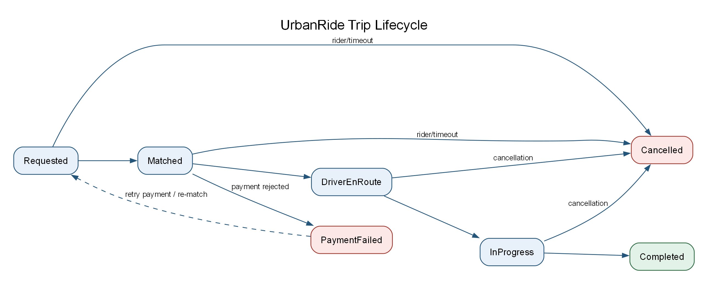
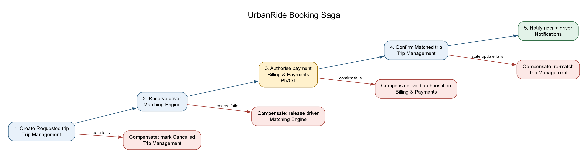

## 6. Data Design & Consistency

<!-- OWNER: M3 | SOURCE: Brief §5.5, §5.5.1, §5.6, §5.6.1, §5.7 -->
<!-- TARGET: ~3 pages | RUBRIC: part of 25% -->

### 6.1 Storage selection per service

| Data | Store | Consistency | Reasoning |
|---|---|---|---|
| Trip records | PostgreSQL (Multi-AZ) | Strong (CP) | Source of truth for the trip lifecycle; the workload is only about 12 writes/sec. |
| Billing and payments | Separate PostgreSQL instance | Strong (CP) | Prevents double charging and isolates the financial blast radius. |
| Driver location | Redis without persistence | AP / disposable | About 19,000 updates/sec; drivers refresh every 4 seconds, so a crashed index rebuilds quickly. |
| Surge multipliers | Redis with Flink state | Eventual (AP) | A multiplier that is seconds stale is preferable to unavailable pricing. |
| Rider and driver profiles | PostgreSQL with read replica | Strong | Durable, low-volume records with read-heavy access. |
| Completed trip history | PostgreSQL to S3 tiers | Strong at write time | The volume problem is storage capacity, not transaction throughput. |

<!-- State the principle: pick per service; do not uniformly pick one. -->

### 6.2 CAP positioning

<!-- Which services are CP, which are AP, and why.
     Cite Uber precedent: Ringpop is AP; surge favours freshness over consistency. -->

Storage is selected per bounded context rather than imposed uniformly. Trip Management and Billing are CP: they prefer a clear failure during a partition to two conflicting authoritative records or a double charge. Location Ingestion and candidate matching are AP: a slightly stale driver position is acceptable because the next GPS ping arrives within 4 seconds, while refusing all matching during a brief inconsistency would harm availability. Surge Pricing also favours AP because freshness is more useful than a perfectly consistent multiplier. This follows Uber's documented precedent: Ringpop is AP, and surge pricing explicitly favours freshness and availability over consistency.

### 6.3 Storage tiering strategy

<!-- EXPLICIT RUBRIC REQUIREMENT -->

| Tier | Contents | Store | Access pattern | Cost |
|---|---|---|---|---|
| Hot | Last 90 days | PostgreSQL | Frequent support, disputes, receipts, and active trips | Highest |
| Warm | 90 days to 1 year | S3 Standard-IA, Parquet | Occasional analytics and reporting | Low |
| Cold | More than 1 year | S3 Glacier Instant | Rare legal and audit access | Minimal |

<!-- Volume justification: ~730 GB/year of trip records.
     MECHANISM: monthly partitioning + partition-drop archival to Parquet on S3.
     Why not CDC: trip records are immutable; DROP is metadata-only vs
     VACUUM pressure from row-wise DELETE. -->

At 1,000,000 rides/day and approximately 2 KB per record, trip history grows by about 2 GB/day, or roughly 730 GB/year. The `trips` table is partitioned by month (`trips_2026_09`, `trips_2026_10`, and so on). A nightly job exports partitions older than 90 days to Parquet on S3, verifies the export, and then drops the PostgreSQL partition. S3 lifecycle rules move warm data to cold storage automatically.

Partition-drop is preferable to CDC for archival because completed trips are immutable: they are written once and do not need row-level change events. Dropping a partition is a metadata operation, whereas deleting tens of millions of rows creates dead tuples and VACUUM pressure on the primary. The existing `trip.events` Kafka stream can feed analytics without adding a CDC connector.

### 6.4 Distributed transactions — the Saga pattern

<!-- EXPLICIT RUBRIC REQUIREMENT -->
<!-- Why single ACID cannot span services; orchestration vs choreography and our
     hybrid choice; booking saga steps + compensations; pivot transaction;
     idempotency on trip_uuid -->

Each service owns its database, so one ACID transaction cannot cover a booking. We use orchestration for the booking Saga because Trip Management must expose the current state and coordinate real compensations. Downstream reactions such as analytics, receipts, and driver earnings are choreographed from `TripCompleted` events. Every participant is idempotent and uses `trip_uuid` as its idempotency key; retries and duplicate events therefore become no-ops.

| # | Step | Service | Compensation on failure |
|---|---|---|---|
| 1 | Create trip in `Requested` state | Trip Management Service | Mark trip `Cancelled` |
| 2 | Reserve a driver with atomic assignment | Matching Engine | Release the driver assignment |
| 3 | Authorise the payment method | Billing Service | Void the authorisation |
| 4 | Confirm trip as `Matched` | Trip Management Service | Revert to `Requested` and re-match |
| 5 | Notify rider and driver | Notification Service | None; delivery is informational and idempotent |

Step 3 is the pivot transaction. Once authorisation succeeds, the workflow moves forward wherever possible rather than attempting an unsafe global rollback.

### 6.5 Concurrency: the double-booking problem

<!-- Atomic Redis SET NX rather than a DB row lock; loser re-queries.
     This is how lock contention is designed out. -->

The geo-index is only a candidate source, not a reservation system. Assignment uses an atomic Redis compare-and-set: `SET driver:{id}:assignment {trip_uuid} NX EX 30`. Only one simultaneous request wins. The loser discards that candidate, re-queries, and tries the next driver. This removes database row-lock contention from the hot path while Trip Management remains the authoritative record of the ride.

### 6.6 Surge quote pinning

<!-- 60-second pinned quote so displayed fare = charged fare -->

Surge is eventually consistent, so the live multiplier may change between fare estimation and confirmation. Fare estimation therefore creates a `quote_id` containing the base fare and multiplier, stores it in Redis with a 60-second TTL, and returns it to the rider. The booking request carries that ID, and Billing charges the pinned multiplier. An expired quote must be re-quoted before confirmation. This gives the rider price certainty while bounding our exposure to adverse surge movement.

---

**Figure 5 - Trip lifecycle state machine.** The authoritative lifecycle progresses from `Requested` through `Matched`, `DriverEnRoute`, `InProgress`, and `Completed`, with cancellation and payment-failure exits.

<!-- DIAGRAM 5 | OWNER: M3 | FILE: diagrams/state-01-trip-lifecycle.png
     Requested -> Matched -> DriverEnRoute -> InProgress -> Completed,
     plus Cancelled and PaymentFailed branches. -->

---

**Figure 6 - Booking Saga and compensating transactions.** Trip Management orchestrates the booking steps; failed reservations or payment authorisation invoke the listed compensations, with payment authorisation marked as the pivot.

<!-- DIAGRAM 6 | OWNER: M3 | FILE: diagrams/saga-01-booking.png
     Happy path across services plus compensations on failure.
     Mark the pivot transaction. -->
