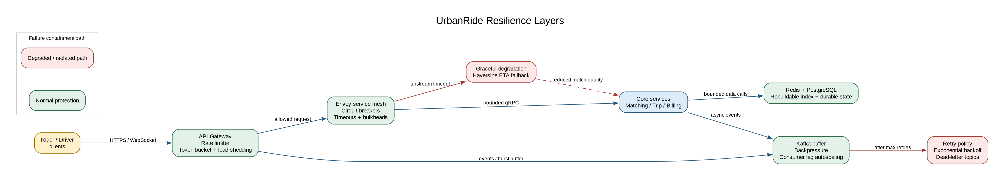

## 7. Scalability & Resiliency Blueprint

<!-- OWNER: M3 | SOURCE: Brief §5.8 | TARGET: ~2 pages -->
<!-- ALL FOUR named mechanisms must appear - the assignment lists them by name. -->

### 7.1 Circuit breakers

<!-- Envoy sidecar outlier detection; service-mesh layer not application code.
     Cite Lyft rationale: identical networking code copy-pasted across services
     became unmaintainable. -->

Every synchronous service call passes through an Envoy sidecar. Outlier detection ejects an upstream after repeated 5xx responses, while bounded retries apply only to idempotent operations. The circuit opens before a failing dependency consumes all caller threads, then probes recovery through half-open requests. This keeps failure local and follows Lyft's service-mesh lesson: duplicated networking logic in every service becomes difficult to maintain.

### 7.2 Rate limiters

<!-- Token bucket per rider/driver/IP at edge; per-service quotas in mesh -->

The API Gateway applies token-bucket limits independently per rider, driver, and source IP. Envoy adds per-service quotas so a noisy client or an unhealthy caller cannot exhaust a downstream pool. Limits return a clear throttling response and include enough telemetry to distinguish abuse from a legitimate event spike.

### 7.3 Backpressure

<!-- Kafka consumer lag -> autoscale; bounded queues;
     load shedding order (shed fare estimates before ride requests) -->

Kafka is the burst buffer for location and trip events. Producers remain responsive while consumer lag grows; autoscaling adds consumers when lag crosses its threshold, and bounded in-process queues prevent a consumer from exhausting memory. At the gateway, load shedding removes fare-estimate traffic before ride-request traffic when lag or queue depth becomes unsafe. The system therefore degrades in freshness, especially for surge calculations, rather than losing availability for core requests.

### 7.4 Dead-letter queues

<!-- Retry with exponential backoff -> .dlq topic;
     failed messages never block live traffic -->

Consumers retry failed messages with exponential backoff and a maximum attempt count. A message that still fails is published to the corresponding `.dlq` topic with its original key, error metadata, and attempt history. Dead-lettered messages are isolated from live traffic and can be inspected, repaired, and replayed without blocking healthy partitions.

### 7.5 Additional patterns

<!-- Graceful degradation, timeouts everywhere, bulkheads -->

Timeouts are bounded on every remote call; Matching to Routing Service uses a 100 ms timeout. Bulkheads give each downstream its own connection pool and worker budget, so a slow Billing Service cannot consume Trip Management Service capacity. Graceful degradation uses Haversine ranking when Routing Service is unavailable: match quality drops, but the request path remains available. Redis location data is intentionally rebuildable, while trip and billing state remains durable in PostgreSQL.

### 7.6 Failure scenario walkthroughs

<!-- Short paragraph each -->

**5x traffic spike.** Kafka absorbs the event burst, consumer lag triggers HPA scale-out, and Matching scales on p99 latency. Fare estimates are shed first if the gateway reaches its safety threshold; ride requests retain priority. Surge values may be a few seconds stale, but the system continues accepting core work.

**Redis cluster failure.** New matching fails closed rather than assigning without a reservation. Multi-AZ Redis failover limits the outage, and drivers re-register their locations within four seconds after recovery. In-flight trips continue because their source of truth is PostgreSQL; new ride creation can return a clear retry response while the circuit is open.

**Network partition between services.** Circuit breakers open and calls fail fast. Matching may still read its local candidate index, but Trip Management Service does not create a ghost trip without a durable write. The rider receives a retryable error, while already committed trips continue through their Saga retries and idempotent events.

**Spot instance reclaim on connection-holding services.** WebSocket termination stays on on-demand nodes because each node holds connection state. Spot is limited to genuinely stateless REST pods, matching workers, consumers, and OSRM replicas. Deploys still drain gracefully: stop new connections, notify clients, and use jittered exponential reconnect to avoid a thundering herd.

---

**Figure 7 - Resilience layers across the request path.** Rate limiting and load shedding begin at the edge, circuit breakers and timeouts contain synchronous failures in the service mesh, Kafka absorbs asynchronous bursts, and failed messages move to dead-letter topics after bounded retries.

<!-- DIAGRAM 7 (OPTIONAL - build only if time allows) | OWNER: M3
     FILE: diagrams/resilience-01-layers.png
     Where each mechanism sits in the request path. -->
