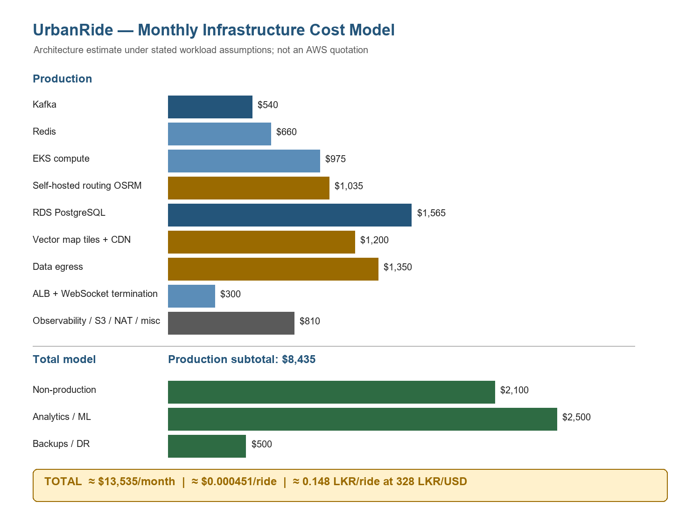

## 8. Infrastructure & Cost

<!-- OWNER: M4 | SOURCE: Brief §6 (all) | TARGET: ~3.5 pages | RUBRIC: 20% -->

### 8.1 Budget in real terms

<!-- 10 LKR -> USD -> daily / monthly / annual ceiling.
     STATE THE FX RATE AND THE DATE IT WAS CHECKED. -->

We interpret the 10 LKR target as cloud infrastructure and platform operating cost, excluding payment processing fees, driver payouts, and customer acquisition.

For this working model, the FX rate is **328 LKR/USD**, recorded on **13 September 2026** as a rounded working assumption. The Central Bank of Sri Lanka page displayed an indicative USD/LKR spot rate of 328.5966 when checked, but 328 is retained as a rounded conversion assumption rather than an exact settlement rate. At 328 LKR/USD, 10 LKR is approximately **$0.0305 per ride**. The resulting ceilings are:

| Period | Budget in LKR | Budget in USD at 328 LKR/USD |
|---|---:|---:|
| Day (1,000,000 rides) | 10,000,000 | ~$30,488 |
| Month (30,000,000 rides) | 300,000,000 | ~$914,634 |
| Year (365,000,000 rides) | 3,650,000,000 | ~$11,128,049 |

The FX rate is an assumption/market value, not a guaranteed conversion rate; recheck it before final submission.

### 8.2 The third-party API finding

<!-- LEAD WITH THIS - it is the strongest cost argument in the document -->

| Call | UrbanRide workload assumption | Current vendor list price | Final team scenario cost/ride |
|---|---|---|---|
| Compute Route Matrix Essentials | 20 elements/ride | $5/1,000 elements at first listed paid tier | ~$0.160 |
| Compute Routes Essentials | 2 requests/ride | $5/1,000 requests at first listed paid tier | ~$0.010 |
| Geocoding | 2 requests/ride | $5/1,000 requests at first listed paid tier | ~$0.010 |
| Dynamic Maps | 2 loads/ride | $7/1,000 loads at first listed paid tier | ~$0.014 |
| **Google Maps full team comparison** | | | **~$0.194** |

<!-- The Route Matrix element-billing detail is what makes it catastrophic.
     Final team comparison figure: ~64 LKR/ride = 6.4x over budget.
     Conclusion: self-hosted routing is mandatory, not an optimization.
     Note Grab's precedent (Pharos on OSM graphs). -->

Google's official [global pricing list](https://developers.google.com/maps/billing-and-pricing/pricing), checked 13 September 2026, lists these first-tier Essentials prices. The [Routes billing documentation](https://developers.google.com/maps/documentation/routes/usage-and-billing) confirms that Compute Routes is billed per request while Compute Route Matrix is billed per element, where elements equal origins multiplied by destinations. Google also aggregates monthly billable events across projects linked to the billing account and applies volume tiers. The vendor list prices and UrbanRide workload quantities are shown separately; the final team scenario is not presented as a direct calculation from the current rate card. The actual high-volume tier and any negotiated discount remain **VERIFY** items.

For the final cross-member comparison, M4 follows M3's approved team scenario: Route Matrix at approximately `$0.160/ride`, plus Routes `$0.010`, Geocoding `$0.010`, and Dynamic Maps `$0.014`, for approximately **$0.194/ride**. At the working rate of 328 LKR/USD this is approximately **63.6 LKR/ride**, conventionally reported as **~64 LKR/ride**, or **6.4x** the 10 LKR budget. This team comparison is an illustrative workload scenario, not a guaranteed vendor bill; the current vendor SKU tiers, account volume pricing and any negotiated discount remain **VERIFY** items. Excluding Route Matrix, the remaining **$0.034/ride** is approximately **11.15 LKR/ride**, or **1.1x** the budget, still above the target.

At this scale, a third-party mapping/routing stack breaks the cost target. Self-hosted **OSRM** using OpenStreetMap road data is therefore mandatory for this architecture, not merely an optional optimization. Grab's use of OSM-derived routing infrastructure is a cautious industry precedent for this direction; this document does not rely on an unsupported precise comparison.

### 8.3 Infrastructure cost model

The approximately **$13,535/month** figure is an architecture-level cost model, not an AWS quotation. The actual bill depends on AWS regional pricing, selected instance families, Spot availability, reserved-instance or Savings Plans discounts, data transfer, traffic volume, storage, CDN usage, observability volume and actual workload behaviour. Under the stated workload and modelling assumptions, the estimated infrastructure cost is approximately $13,535/month; it must be validated against current AWS and vendor pricing before deployment.

| Component | Sizing rationale | Monthly (USD) |
|---|---|---|
| Kafka | 3 on-demand brokers; ~25,000 messages/sec design point; replication factor 3; 24-hour retention | $540 |
| Redis | 3 shards plus replicas for ~75,000 online drivers, H3 lookups, surge state and hot quote/cache data | $660 |
| EKS compute | ~12 worker nodes with ~2x spike headroom; ~70% spot for suitable stateless workloads | $975 |
| Self-hosted routing OSRM | CPU/RAM-heavy in-memory road graph and horizontally scalable ETA replicas | $1,035 |
| RDS PostgreSQL | Separate Trip Management Service and Billing Service instances with Multi-AZ/replica durability | $1,565 |
| Self-hosted vector map tiles + CDN | ~18 TB/month map tile traffic, avoiding per-request third-party map pricing | $1,200 |
| Data egress | ~500 KB per completed ride, approximately 15 TB/month | $1,350 |
| ALB + WebSocket termination | Approximately 75,000 persistent online-driver connections at peak | $300 |
| Observability, S3 archive, NAT, misc | Logs, metrics, S3 lifecycle storage, NAT and operational overhead | $810 |
| **Production subtotal** | | **$8,435** |
| Non-production | Development and staging environments | $2,100 |
| Analytics/ML | Analytics warehouse and ML training workloads | $2,500 |
| Backups/DR | Backups and single-region recovery provisions | $500 |
| **TOTAL** | Modelled monthly architecture estimate | **~$13,535** |

AWS classification for this model: **Kafka — Modelled estimate requiring workload validation; Redis — Modelled estimate requiring workload validation; EKS compute — Modelled estimate requiring workload validation; self-hosted OSRM — Modelled estimate requiring workload validation; RDS PostgreSQL — Modelled estimate requiring workload validation; self-hosted vector map tiles + CDN — Modelled estimate requiring workload validation; data egress — Modelled estimate requiring workload validation; ALB + WebSocket termination — Modelled estimate requiring workload validation; observability, S3 archive, NAT and misc — Modelled estimate requiring workload validation.** The official AWS pricing pages are reference sources, not evidence that these workload-specific monthly amounts are verified bills.

The modelled infrastructure cost is $13,535 / 30,000,000 rides = **~$0.000451/ride**, or **~0.148 LKR/ride** at 328 LKR/USD. This is approximately **1.5%** of the 10 LKR ceiling. It is an architecture estimate, not a guaranteed AWS bill. AWS ap-south-1 regional prices, usage discounts, traffic patterns and FX must be verified: **Estimate — verify against current AWS pricing before final submission.**

### 8.4 Instance sizing rationale

<!-- EXPLICIT RUBRIC REQUIREMENT
     Short paragraph per major component explaining WHY THAT SIZE,
     tied back to the §3.3 scale figures. -->

**Kafka.** Three on-demand brokers support the approximately 25,000 messages/sec design point with replication factor 3 and 24-hour retention. Kafka is stateful, so brokers are not placed on spot capacity.

**Redis.** Three shards plus replicas handle the high-operation, low-volume location workload for approximately 75,000 online drivers. Redis stores driver location, H3-based lookup state, surge state and hot quote/cache data; stale locations are naturally replaced by the next 4-second GPS ping.

**EKS.** Approximately 12 worker nodes support roughly 50 pods at peak with approximately 2x spike headroom. The model uses approximately 70% spot and 30% on-demand capacity for workloads that can tolerate replacement.

**OSRM.** OSRM is CPU/RAM intensive because the road graph is kept in memory. It serves approximately 30 million ETA calculations/day and can scale horizontally by adding replaceable replicas.

**PostgreSQL.** The trip workload is approximately 12 transactions/sec. Separate Multi-AZ RDS PostgreSQL instances with replicas support Trip Management Service and Billing Service durability while preserving Billing Service's isolated financial blast radius; neither workload requires excessive horizontal database sharding.

**Map tiles.** Approximately 18 TB/month of map tile traffic is served by self-hosted vector tiles and a CDN, avoiding variable per-request third-party map pricing.

**Egress.** Approximately 500 KB per completed ride gives approximately 15 TB/month of outbound traffic.

**WebSocket termination.** Approximately 75,000 persistent connections require on-demand termination capacity. Persistent connections are not safely treated as disposable spot workloads.

### 8.5 Compute placement: spot vs on-demand

<!-- What runs on spot and what does not.
     THE WEBSOCKET EXCEPTION: a service holding 75k persistent connections is not
     stateless; it runs on-demand. Graceful drain + jittered client reconnect as
     defence in depth. Interruption costs can materially reduce realized savings;
     our defence is placement discipline. -->

Spot is suitable for **stateless API pods, Matching Engine workers, Kafka consumers, replaceable OSRM replicas, and batch/background jobs**. On-demand capacity is used for **Kafka brokers, Redis, PostgreSQL, ALB/ingress, and WebSocket termination**.

Spot is appropriate only when interruption does not lose important state or cause unacceptable reconnection/recovery behaviour. In particular, approximately 75,000 persistent WebSocket connections must not be terminated by spot interruption: a simultaneous interruption could create a reconnect storm. WebSocket termination therefore remains on-demand, with graceful drain on SIGTERM and jittered client reconnect as defence in depth. Interruption and recovery costs can materially reduce realized spot savings for poorly chosen workloads; placement discipline is the control in this design.

### 8.6 Autoscaling triggers

<!-- EXPLICIT RUBRIC REQUIREMENT -->

| Service | Scale-out trigger | Scale-in | Min/Max |
|---|---|---|---|
| Location Ingestion Service | CPU >60% OR WebSocket connections >20k/pod | CPU <30% for 10 min | 4/20 |
| Matching Engine | p99 latency >200ms OR CPU >65% | CPU <30% for 10 min | 4/24 |
| Kafka consumers | Consumer lag >10,000 messages | Lag <1,000 for 5 min | 3/30 |
| Routing Service | CPU >70% | CPU <35% for 15 min | 2/12 |
| Trip Management Service | CPU >70% | CPU <35% | 3/12 |
| Billing Service | CPU >70% | CPU <35% | 3/12 |

HPA uses CPU and application metrics; Kafka consumer lag is an application-specific scaling metric. Karpenter or cluster autoscaler manages nodes. Slow scale-in cooldowns prevent thrashing during oscillating demand, especially weather-driven spikes.

<!-- Note the deliberately slow scale-in cooldowns and why
     (prevents thrashing during oscillating weather demand). -->

### 8.7 Notification cost strategy

<!-- Push-first, SMS for login OTP only.
     Contrast: 2 SMS/ride = 2 LKR/ride = 20% of budget, ~13x all server costs. -->

The Notification Service is push-first: push notifications carry normal ride lifecycle events, while SMS is reserved for login OTP. Sending 2 SMS per ride at an assumed approximately 1 LKR/SMS would cost approximately **2 LKR/ride**, already **20%** of the 10 LKR budget and much larger than the modelled infrastructure cost of approximately 0.148 LKR/ride. This local bulk SMS price is an assumption: **VERIFY with the provider before final submission.**

For OTP, assume approximately 500,000 monthly active riders, approximately 1 OTP/rider/month, and approximately 1 LKR/SMS. That gives approximately **500,000 LKR/month**, or **~0.017 LKR/ride** over 30 million rides. The OTP-only notification scenario is therefore approximately 0.148 + 0.017 = **~0.17 LKR/ride**, subject to SMS-price verification.

### 8.8 Result & scenario comparison

| Scenario | LKR/ride | vs budget |
|---|---|---|
| Google Maps full, final team comparison scenario | ~63.6–64 | ~6.4x budget — **FAIL** |
| Google Maps without Route Matrix | ~11.2 | ~1.1x budget — **FAIL** |
| Self-hosted OSRM + 2 SMS/ride | ~2.15 | ~21.5% of budget — **PASS** |
| Self-hosted OSRM + OTP-only SMS | ~0.17 | ~1.7% of budget — **PASS** |

These are scenario estimates based on the assumptions in Appendix A. The key conclusion is that the 10 LKR budget is not the binding constraint after self-hosting routing and maps. Latency, burst handling and reliability are the stronger design constraints.

### 8.9 Cost-optimization levers summary

| Lever | Our application | Expected saving |
|---|---|---|
| Spot compute for stateless workloads | API pods, Matching Engine workers, consumers and replaceable OSRM replicas | High, subject to interruption cost |
| On-demand placement for stateful/persistent workloads | Kafka, Redis, PostgreSQL and WebSocket termination | Avoided recovery and reconnect cost |
| HPA + Karpenter/cluster autoscaling | Match pods and nodes to demand | Medium |
| Self-hosted OSRM | Keep routing cost independent of per-request API billing | High / avoided variable cost |
| Self-hosted vector map tiles + CDN | Serve map traffic without third-party per-request pricing | High / avoided variable cost |
| PostgreSQL data tiering | Keep only hot transactional data in PostgreSQL | Medium |
| S3 archival | Move completed immutable trips out of hot storage | Medium |
| Push-first notifications | Use SMS only for login OTP | High / avoided variable cost |
| Serverless for lightweight asynchronous workloads where appropriate | Avoid idle capacity for small background jobs | Low to medium |
| Single-region deployment | Keep one production footprint in ap-south-1 | Avoided multi-region duplication |

**Storage tiering.** Keep the last 90 days hot in PostgreSQL. Export partitions older than 90 days nightly to S3 Standard-IA in Parquet, verify the export, and then drop the old PostgreSQL partition. Move data older than one year to S3 Glacier Instant Retrieval through the S3 lifecycle. At approximately 2 GB/day, trip records are approximately 730 GB/year. Monthly PostgreSQL partitions make dropping old data preferable to DELETE because it avoids unnecessary dead tuples and VACUUM pressure. Completed trips are immutable, so archival does not require CDC; existing Kafka trip events can feed analytics.

---

**Figure 8 — Monthly infrastructure spend by component.** The model shows that routing, map tiles and egress are the dominant variable-cost categories.

<!-- DIAGRAM 8 | OWNER: M4 | FILE: diagrams/cost-01-breakdown.png
     Bar or pie of monthly spend. Makes the point that routing/egress/tiles
     dominate, not compute. -->
